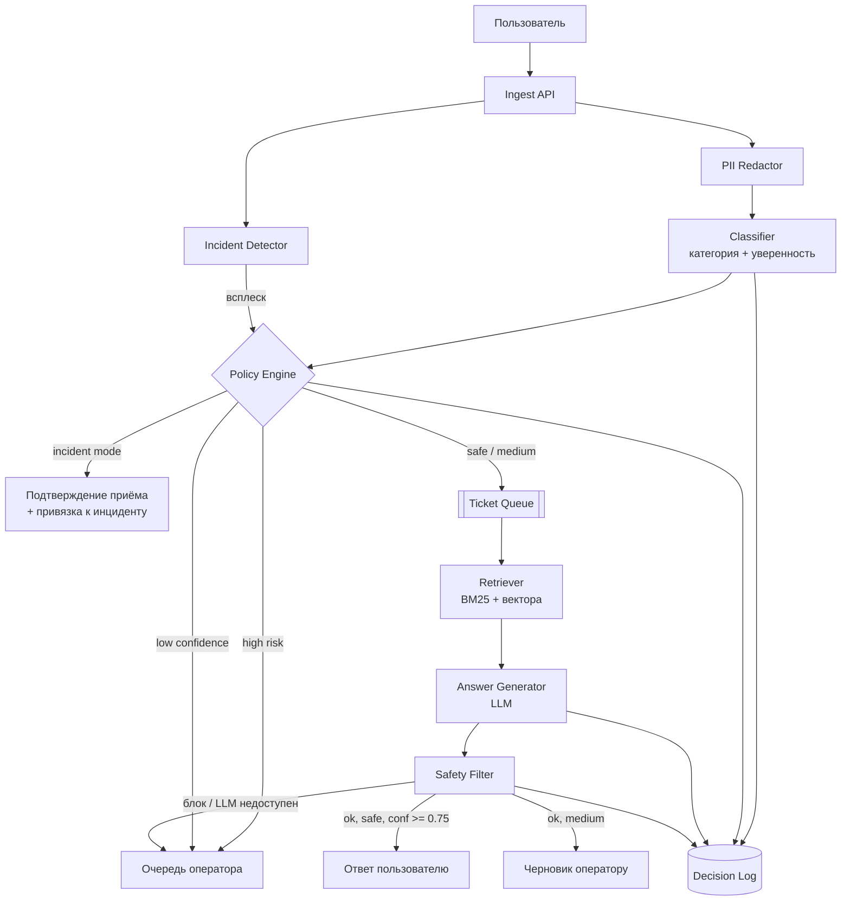

# Архитектура

## Принцип разделения

Система разрезана на **быстрый синхронный путь** и **медленный асинхронный**.
Синхронно выполняется только то, что нужно для маршрутизации: нормализация, редакция PII,
классификация, оценка риска. Бюджет — 500 мс на тикет. Генерация ответа, retrieval по базе знаний
и вызовы LLM живут за очередью, потому что их латентность зависит от внешнего провайдера
и не должна попадать в SLA маршрутизации.

Второй принцип: **автоматическое действие разрешено только там, где ошибка обратима**.
Возвраты денег и удаление аккаунта не закрываются автоматически ни при какой уверенности модели.

## Компоненты

| Компонент | Ответственность | Синхронность |
|---|---|---|
| Ingest API | приём из чата, email, веб-формы, мобильного приложения; нормализация в единую схему | синхронно |
| PII Redactor | маскирование email, телефонов, номеров карт до любого хранения и внешнего вызова | синхронно |
| Classifier | категория + уверенность; правила поверх модели для жёстких категорий | синхронно, ~1 мс |
| Policy Engine | решение auto / suggest / escalate по категории, риску, уверенности и состоянию инцидента | синхронно |
| Router | постановка в очередь оператора нужной линии | синхронно |
| Ticket Queue | брокер сообщений между быстрым и медленным путями, буфер на всплесках | — |
| Retriever | поиск фрагментов базы знаний, гибрид BM25 и векторного поиска | асинхронно |
| Answer Generator | LLM с контекстом из retriever, строгий system prompt, ограничение на длину | асинхронно |
| Safety Filter | проверка черновика до отправки: обещания денег, персональные данные, prompt injection | асинхронно |
| Operator UI | очередь, черновик ответа, ссылки на источники, кнопка «отправить / переписать» | — |
| Decision Log | неизменяемый журнал: вход, категория, уверенность, решение, версии моделей | асинхронно |
| Incident Detector | детектор всплеска однотипных обращений, включает режим инцидента | асинхронно |

## Поток данных

## Хранилища

- **PostgreSQL** — тикеты, решения, состояние очередей. Источник правды для аудита.
- **Очередь (Kafka или RabbitMQ)** — развязка быстрого и медленного путей, буфер на всплесках.
- **Векторное хранилище** — эмбеддинги базы знаний и решённых тикетов, обновление по расписанию.
- **Кэш ответов (Redis)** — ключ по нормализованному тексту и категории; на всплесках даёт
  дешёвое схлопывание однотипных обращений без обращения к LLM.
- **Объектное хранилище** — вложения, изначально вне периметра LLM.

## Поведение под нагрузкой

Обычный режим: 200k тикетов в сутки, это около 2.3 RPS в среднем и порядка 10 RPS в пике часа.
Всплеск: 10–20k за 10 минут, то есть до 33 RPS — в 15 раз выше среднего.

Синхронный путь масштабируется горизонтально и рассчитан на пиковую нагрузку с запасом:
классификация занимает единицы миллисекунд, узкое место — сеть, а не модель.
Асинхронный путь на всплеске не масштабируется вслед за нагрузкой: LLM-провайдер имеет квоту.
Поэтому при переполнении очереди включается деградация, описанная ниже.

## Запасные пути

| Отказ | Поведение системы |
|---|---|
| LLM API недоступен или таймаут | генерация выключается, тикет уходит оператору с категорией и найденными фрагментами базы знаний; пользователь получает подтверждение приёма, а не пустоту |
| Очередь переполнена | автоответы отключаются полностью, система работает как классификатор-маршрутизатор |
| Классификатор недоступен | fallback на правила по ключевым словам, всё неопознанное — на первую линию |
| Retriever не нашёл релевантного фрагмента (score ниже порога) | генерация не запускается, тикет уходит оператору: отвечать без источника запрещено |
| Режим инцидента | генерация индивидуальных ответов отключается, уходит подтверждение приёма и ссылка на статус |

Общее правило деградации: **система всегда падает в сторону человека, а не в сторону молчания
или выдумывания ответа**.

## Участие человека

- Категории `billing_refund` и `account_deletion` — только оператор, автозакрытие невозможно технически.
- Режим `suggest` — оператор видит черновик и источники, решение об отправке за ним.
- Обучающая петля: правки оператора и факт «черновик отправлен без изменений» пишутся в журнал
  и служат разметкой для следующей итерации модели.
- Выборочный аудит: 1% автоматически закрытых тикетов ежедневно проверяется вручную.

## Что в PoC реализовано, а что спроектировано

Реализовано: PII-редакция, классификатор, retrieval по базе знаний, политика решений,
деградация при недоступности LLM, режим инцидента, журнал решений.
Спроектировано, но не реализовано: очередь, векторное хранилище, Safety Filter,
Operator UI, детектор инцидентов как отдельный сервис (в PoC это флаг), реальный LLM-провайдер.
